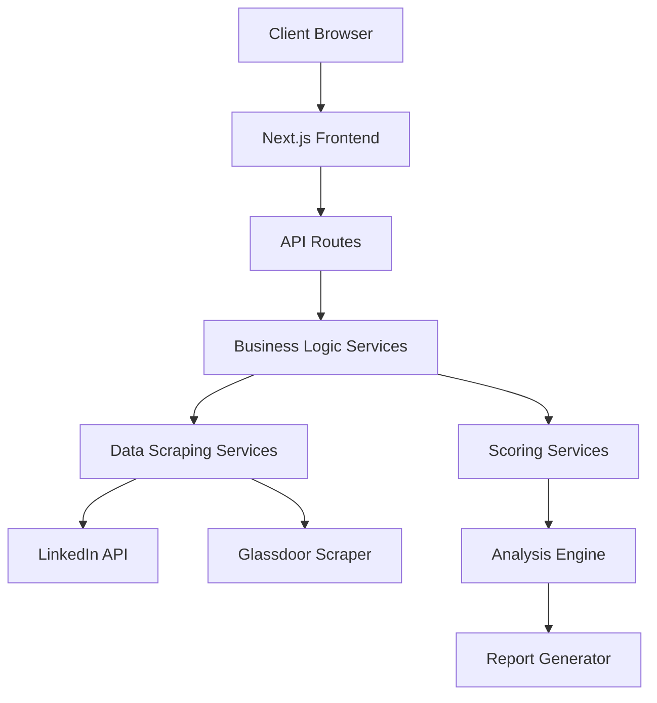
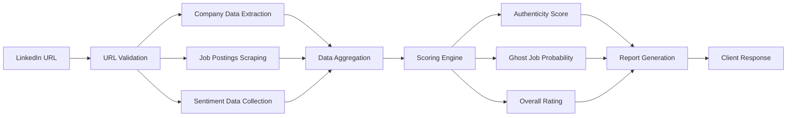

# TruthRecruit - System Architecture

## 📊 Architecture Overview

TruthRecruit follows a modular monolithic architecture built on Next.js 14, designed for scalability and maintainability while keeping complexity low for the MVP stage.

## 🏗 System Design



## 🔧 Core Architecture Principles

### 1. Modular Monolithic Design

**Benefits:**
- Single deployment unit (simpler DevOps)
- Shared types and utilities
- Easy inter-module communication
- Lower operational complexity

**Structure:**
- **Frontend Module**: React components, pages, and UI logic
- **API Module**: RESTful endpoints and request handling
- **Services Module**: Business logic and external integrations
- **Shared Module**: Types, constants, and utilities

### 2. Separation of Concerns

**Presentation Layer** (`src/components/`, `src/app/`)
- React components and pages
- UI state management
- User interaction handling
- Responsive design implementation

**Business Logic Layer** (`src/services/`)
- Company analysis algorithms
- Scoring calculations
- Data processing pipelines
- Business rule enforcement

**Data Access Layer** (`src/services/scraping/`)
- External API integrations
- Web scraping services
- Data transformation
- Rate limiting and caching

**Utility Layer** (`src/lib/`, `src/utils/`)
- Shared functions and constants
- Validation logic
- Helper utilities
- Type definitions

### 3. Type-Safe Development

**Full TypeScript Implementation:**
- Strict type checking enabled
- Interface definitions for all data structures
- Generic types for reusable components
- Compile-time error prevention

**Type Flow:**
```typescript
LinkedIn URL → Company → JobPosting[] → SentimentAnalysis → CompanyAnalysis → Report
```

## 📂 Detailed Module Architecture

### Frontend Architecture

```
src/app/
├── layout.tsx          # Root layout with providers
├── page.tsx           # Landing page with hero section
├── globals.css        # Global styles and design system
└── report/[id]/       # Dynamic report pages
    └── page.tsx       # Company analysis report

src/components/
├── ui/                # Reusable UI components
│   ├── Button.tsx     # Button with variants and states
│   ├── Input.tsx      # Form input with validation
│   ├── Card.tsx       # Content containers
│   └── Badge.tsx      # Status indicators
├── layout/            # Layout components
│   ├── Header.tsx     # Navigation and branding
│   └── Footer.tsx     # Links and company info
└── features/          # Business feature components
    ├── CompanyAnalyzer.tsx    # URL input and validation
    ├── CompanyHeader.tsx      # Company information display
    ├── ScoreCard.tsx          # Metric visualization
    └── RecommendationsList.tsx # Action items
```

**Component Design Patterns:**
- **Composition over Inheritance**: Flexible component composition
- **Render Props**: Reusable logic sharing
- **Compound Components**: Related components working together
- **Controlled Components**: Predictable state management

### API Architecture

```
src/app/api/
└── analyze/
    └── route.ts       # POST /api/analyze endpoint
```

**API Design Principles:**
- **RESTful Design**: Standard HTTP methods and status codes
- **Request Validation**: Input sanitization and validation
- **Error Handling**: Consistent error response format
- **Performance**: Response time tracking and optimization
- **Security**: Rate limiting and input sanitization

**Request/Response Flow:**
```
1. Client submits LinkedIn URL
2. URL validation and sanitization
3. Parallel data collection from multiple sources
4. Business logic processing and scoring
5. Response formatting and caching
6. Client receives structured analysis
```

### Services Architecture

#### Scraping Services
```typescript
// LinkedIn data extraction
class LinkedInScraper {
  async scrapeCompanyProfile(url: string): Promise<Company>
  async scrapeJobPostings(slug: string): Promise<JobPosting[]>
}

// Employee sentiment analysis
class GlassdoorScraper {
  async scrapeSentimentData(company: string): Promise<SentimentAnalysis>
}
```

**Scraping Strategy:**
- **Rate Limiting**: Respectful request patterns
- **Error Recovery**: Retry mechanisms and fallbacks
- **Data Quality**: Validation and sanitization
- **Caching**: Response caching to reduce load

#### Scoring Services
```typescript
// Core analysis engine
class CompanyAnalyzer {
  async analyzeCompany(
    company: Company,
    jobs: JobPosting[],
    sentiment: SentimentAnalysis
  ): Promise<CompanyAnalysis>
}

// Specialized scoring algorithms
class HiringAuthenticityScorer {
  calculateHiringAuthenticityScore(): number
  calculateGhostJobProbability(): number
}
```

**Scoring Algorithm Architecture:**
- **Weighted Scoring**: Multiple factors with configurable weights
- **Normalization**: Scores normalized to 0-100 scale
- **Transparency**: Explainable scoring factors
- **Adaptability**: Easy to adjust weights and add factors

## 🔄 Data Flow Architecture

### Analysis Pipeline



### Error Handling Strategy

**Graceful Degradation:**
- Partial data analysis if some sources fail
- Default scores for missing data points
- User-friendly error messages
- Retry mechanisms for transient failures

**Error Types and Handling:**
```typescript
interface AnalysisError {
  type: 'validation' | 'network' | 'parsing' | 'business'
  message: string
  recoverable: boolean
  fallbackData?: Partial<CompanyAnalysis>
}
```

## 🚀 Performance Architecture

### Frontend Performance

**Optimization Strategies:**
- **Code Splitting**: Dynamic imports for heavy components
- **Image Optimization**: Next.js Image component with lazy loading
- **Bundle Analysis**: Regular bundle size monitoring
- **Caching**: Browser caching for static assets
- **Prefetching**: Smart prefetching for likely navigation

### Backend Performance

**API Optimization:**
- **Parallel Processing**: Concurrent data collection from multiple sources
- **Caching**: In-memory caching for repeated requests
- **Response Compression**: Gzip compression for large responses
- **Database Queries**: Optimized queries (when database is added)

### Monitoring and Observability

**Performance Metrics:**
- API response times
- Scraping success rates
- Error rates by service
- User engagement metrics
- System resource utilization

## 🔒 Security Architecture

### Data Protection

**Input Security:**
- URL validation and sanitization
- XSS prevention
- CSRF protection
- Rate limiting per IP

**Scraping Ethics:**
- Respectful rate limiting
- robots.txt compliance
- Terms of service adherence
- User-agent identification

**Data Privacy:**
- No personal data storage
- Anonymized analytics
- GDPR compliance ready
- Secure data transmission

## 📈 Scalability Considerations

### Horizontal Scaling

**Current Design Benefits:**
- Stateless API endpoints
- Serverless function compatibility
- CDN-friendly static assets
- Database-agnostic data layer

**Future Scaling Options:**
- Microservices extraction
- Dedicated scraping clusters
- Caching layers (Redis)
- Message queues for async processing

### Vertical Scaling

**Resource Optimization:**
- Memory-efficient data structures
- CPU-optimized algorithms
- Efficient string processing
- Garbage collection optimization

## 🔮 Future Architecture Evolution

### Phase 2: Enhanced Data Layer

**Database Integration:**
```typescript
interface DataLayer {
  companies: CompanyRepository
  analyses: AnalysisRepository
  users: UserRepository
  cache: CacheRepository
}
```

### Phase 3: Microservices Migration

**Service Decomposition:**
- Authentication Service
- Company Data Service  
- Analysis Engine Service
- Report Generation Service
- Notification Service

### Phase 4: Machine Learning Integration

**ML Pipeline:**
```typescript
interface MLServices {
  sentimentAnalyzer: NLPService
  ghostJobDetector: ClassificationService
  recommendationEngine: RecommendationService
  trendPredictor: TimeSeriesService
}
```

## 🛠 Development Architecture

### Build and Deploy Pipeline

```yaml
# CI/CD Pipeline
stages:
  - lint_and_typecheck
  - unit_tests
  - integration_tests  
  - build_application
  - deploy_staging
  - e2e_tests
  - deploy_production
```

### Development Environment

**Local Development:**
- Hot reload for instant feedback
- TypeScript compilation
- ESLint and Prettier integration
- Mock data for rapid prototyping

**Testing Architecture:**
- Unit tests for pure functions
- Component tests for UI logic
- Integration tests for API endpoints
- E2E tests for user journeys

## 📋 Architecture Decisions Record (ADR)

### ADR-001: Next.js Full-Stack Framework
**Decision:** Use Next.js 14 with App Router
**Rationale:** Unified frontend/backend, excellent DX, built-in optimizations
**Consequences:** Single deployment, simplified architecture, Vercel optimization

### ADR-002: TypeScript for Type Safety
**Decision:** Full TypeScript implementation
**Rationale:** Compile-time error prevention, better DX, refactoring safety
**Consequences:** Learning curve, longer development time, better maintainability

### ADR-003: Modular Monolithic Architecture
**Decision:** Single codebase with clear module boundaries
**Rationale:** Simpler deployment, shared types, easier communication
**Consequences:** Potential for tight coupling, single point of failure

### ADR-004: Mock Data for MVP
**Decision:** Use mock data instead of real scraping
**Rationale:** Faster development, no rate limiting issues, demo-ready
**Consequences:** Limited real-world testing, need migration path

---

This architecture provides a solid foundation for the TruthRecruit MVP while maintaining flexibility for future enhancements and scaling needs.